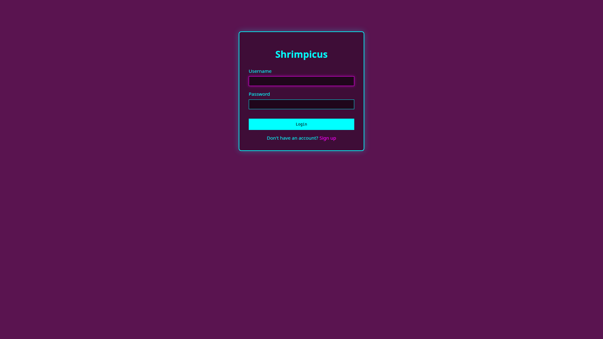
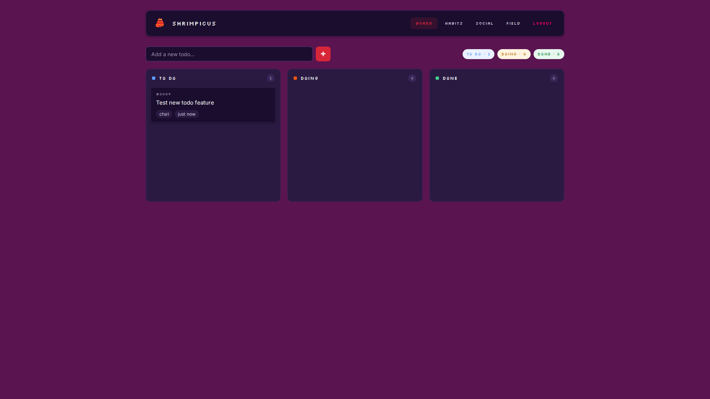
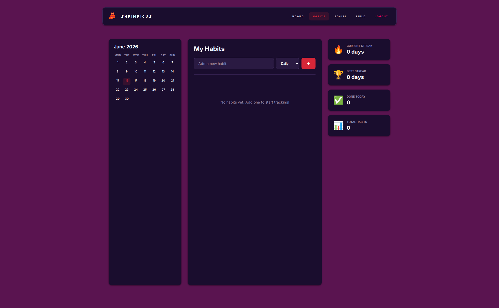

# Shrimpicus

Shrimpicus is a task management tool with social features made to make gettingsthings done just a little bit easier. 

Self improvemnt is marketed as a independent venture, one where you block off the rest of the world and focus on yourself to get better. Why this sounds good in practice, human beings are not made for solitary progress. So this project is my way of bringing a social aspect into self improvement - by having your friends have access to your to dos and habit tracking, you can get recognition and encouragment to complete your tasks and continue working on your tasks.

Key features include a Discord bot with RAG support and a MCP to allow easy addition and changes to tasks, and a web inteface with social features. 

The project is named shrimpicus after my pet cleaner shrimp (RIP) 


## Features

- Add and list reminders from chat
- Yes/No poll check-ins for due reminders
- Todo tracking with optional Notion page creation
- Birthday tracking with daily check
- Journal note capture into Obsidian markdown files
- Optional free-text assistant replies via Ollama

## Quick start

1. Create a Discord bot in the Discord Developer Portal.
2. In **Bot** settings, enable **Message Content Intent**.
3. In **OAuth2 > URL Generator**, select scopes `bot` (and `applications.commands` if needed), then grant permissions like `Send Messages` and `Read Message History`.
4. Open the generated URL and invite the bot to your server.
5. Install and run Ollama (optional but recommended).
6. Copy `.env.example` to `.env`, then set `DISCORD_BOT_TOKEN`.
7. Install and run:

```bash
cd shrimpicus
python -m venv .venv
source .venv/bin/activate
pip install -e .
shrimpicus
```

## Verify connection

- Start the app and wait for `Shrimpicus logged in as ...` in terminal output.
- In Discord, type `!start` and `!helpme` in a channel where the bot has access.

## Security note

- Never commit real Discord bot tokens.
- If a token is exposed, rotate it immediately in the Discord Developer Portal.

## Commands

- `!start`
- `!helpme`
- `!remind <minutes> <text>`
- `!list`
- `!todo add <task>`
- `!todo list`
- `!birthday add <name> <YYYY-MM-DD>`
- `!birthday list`
- `!journal <text>`
- `!ask <question>`

## Notes

- Discord sends Yes/No button check-ins for due reminders.
- If a reminder receives "No", it is snoozed by `DEFAULT_SNOOZE_MINUTES`.
- Notion integration is optional and only active when token/database env vars are set.

## RAG + Tool Calling

The assistant now uses **RAG (Retrieval-Augmented Generation)** to inject context about your todos, reminders, and habits into every conversation, and **tool calling** to directly add, complete, or modify your data when you ask in natural language.

**Examples:**
- *"add buy milk to my list"* — uses the `add_todo` tool
- *"mark todo 3 done and add a reminder to stretch in 20 minutes"* — chains `complete_todo` + `add_reminder`
- *"I went to the gym today"* — logs a habit (auto-creates if needed)

The model decides which tools to call based on your request. Fast regex shortcuts (`td`, `tdl`) still work and are faster for exact patterns.

## MCP Server

The same tool registry is exposed as an **MCP server** so external clients (Claude Desktop, etc.) can manage your todos/reminders/habits.

**Install the MCP dependency:**
```bash
pip install -e '.[mcp]'
```

**Run the server:**
```bash
shrimpicus-mcp
```

**Configure Claude Desktop** — add this to `~/Library/Application Support/Claude/claude_desktop_config.json`:
```json
{
  "mcpServers": {
    "shrimpicus": {
      "command": "/path/to/shrimpicus/.venv/bin/shrimpicus-mcp"
    }
  }
}
```

The server uses `MCP_CHAT_ID` from `.env` (defaults to `0`) to scope all operations.

## Social Features

Shrimpicus now supports multi-user accounts with groups and friend connections.

### Getting Started

1. **Sign up** — Visit `http://127.0.0.1:5005` and create an account (3-20 character username, 6+ character password)
2. **Add friends** — Go to `/social` and add friends by username
3. **Create groups** — Create a group (up to 10 members) and add friends to it
4. **Track progress** — See real-time stats for each group member (todos done today, habits logged today)

### Group Notifications (Discord)

When any user in a group:
- ✅ Completes **all their open todos** for the day, OR
- 🔥 Completes **2+ todos in one day**

The Discord bot sends a notification to the shared channel celebrating their progress.

### Data Migration

Existing todos, reminders, habits, and other data automatically belong to **User ID 1** (the default user). Create that account first to access your existing data, or your data will be isolated until you log in as user 1.

## Screenshots

### Login Page


### Board (Kanban View)


### Habits Tracker


### Social Page


## Changelog

### Unreleased

- **Offline message backlog** — when the bot starts up it now replays messages it missed while offline. Per-channel last-seen message ids are tracked in a new `message_bookmarks` table; on `on_ready` the bot re-reads assistant channels + previously seen channels/DMs, posts a "Catching up on N message(s)..." notice, then processes each eligible message sequentially via the free-text path. Tune with `BACKLOG_ENABLED` and `BACKLOG_MAX_MESSAGES`.
- **LLM todo tools use positions, not DB ids** — `list_todos` now returns a flat 1-indexed list with no database ids and no category groupings exposed; `complete_todo` and `set_todo_status` accept the position shown in that list. Positions reflect the current open-todo list (re-list if it changes between calls). Discord `!todo` commands and the web board still use DB ids unchanged.
- **Cron-style recurring reminders + per-user timezones** — reminders can now be daily / weekly / monthly instead of one-shot. New Discord grammar: `!remind daily 09:00 standup`, `!remind weekly mon 09:00 review`, `!remind monthly 1 10:00 pay rent`, plus `!remind delete <id>` and `!timezone <IANA>`. Times interpret in each user's timezone (selectable from `/account` web dropdown); schema adds `reminders.recur_*` columns and `users.timezone`. LLM gains `add_recurring_reminder`, `list_recurring_reminders`, and `delete_reminder` tools. Yes/No poll buttons re-arm to the next occurrence on click (no snooze for recurring). Missed-fire catch-up is silent.
- **Field redesign** — the Field page is now a peaceful anime/Stardew-style meadow: warm dawn sky, drifting clouds, flapping birds, and big swaying flowers (5 species, varied pastel palettes), one per completed task. Flowers are interactive — hover to grow, click to bloom-burst with petals + a soft chime. A roaming dog trots the meadow, toggleable from the DEBUG panel alongside the existing flower-count slider.
- **Group join codes + Account page** — groups now generate a unique shareable join code (e.g. `ABCD2345`); members join via code instead of being added by username. Schema migrates `groups.owner_id` → `created_by_user_id` and backfills codes. New `/account` page surfaces completed-task count and the Discord linking flow (moved off `/social`). The `/social` page now shows a shared-todo board aggregating every member's todos across all your groups.
- **Combined launcher** — new `shrimpicus-all` entrypoint runs the Discord bot and the Flask web app in one process (web in a daemon thread, bot in the main asyncio loop). Useful for single-command local dev; flags: `--host`, `--port`, `--debug`.
- **Documentation cleanup** — removed the obsolete duplicate todo fix note now that the behavior is covered by current code and docs.
- **README artwork and refreshed screenshots** — replaced the project image and updated web UI screenshots.
- **Discord multi-user isolation** — Discord DMs and server-channel messages now resolve by Discord user ID, enforce private todo ownership, and support one-time web account linking codes.
- **Board due dates and modern add form** — todo cards now show due dates, and the board add form uses collapsible category/due-date controls with a custom picker instead of native selects.
- **OpenRouter API support** — Use hosted models (GPT-4o-mini, Gemini Flash, Claude Haiku, Llama) instead of local Ollama for 10x faster inference (200-500ms vs 2-5s) and lower server requirements. Pricing starts at $0.29-3.60/month. Set `LLM_PROVIDER=openrouter` and `OPENROUTER_API_KEY` in `.env` to enable it. It works globally, including in Hong Kong. All RAG and tool-calling features work with both providers.
- **PostgreSQL support for production** — database layer now supports both SQLite (local development) and PostgreSQL (production hosting). Set `DATABASE_URL` in `.env` to use PostgreSQL. Migration script included (`migrate_to_postgres.py`) to transfer existing SQLite data to PostgreSQL.
- **Production deployment preparation** — Added `psycopg2-binary` and `gunicorn` dependencies, created the `.env.production.example` template, and added the `shrimpicus-bot` entrypoint alias. See `DEPLOYMENT_PLAN.md` for the full hosting guide.
- **Social features with multi-user authentication** — user accounts with username/password (argon2 hashing), login/signup pages, session management. Create groups (max 10 members), add friends, and view real-time stats (todos done, habits logged) for each group member.
- **Group notifications** — Discord bot notifies groups when members complete all their daily todos or complete 2+ todos in one day. Notifications appear in the shared Discord channel with group context.
- **Multi-user data model** — all entities (todos, reminders, habits, birthdays, journal) now scoped to `user_id`. Existing data migrates to default user (ID 1) automatically.
- **Social page** — new `/social` web interface to manage groups, add friends by username, and see group members' daily progress at a glance.
- **RAG + tool calling** — the assistant now injects a context snapshot (todos, reminders, habits, completion count) into every free-text conversation and can directly add, complete, or modify your data via an agentic tool-calling loop. Natural commands like "add buy milk and mark todo 3 done" just work.
- **MCP server** — `shrimpicus-mcp` exposes the same tool registry over stdio so Claude Desktop (or any MCP client) can manage your todos, reminders, and habits. Install it with `pip install -e '.[mcp]'`.
- **Habit tracking** — log daily habits via Discord (`log_habit` tool, or "I went to the gym"), list habits with completion status, and auto-create habits on first mention. New `list_habits_text` and `log_habit_today` methods in `AssistantService`.
- **Database bug fix** — `set_meta` was unreachable dead code after `get_meta`'s return statement; it was split into a working method so the birthday scheduler no longer crashes during its daily check.
- **Habit tracker page** — New `/habits` page in the web viewer. Add habits, toggle today's completion with a tap, view current and longest streak stats per habit, see a 7-day history strip, and use the bottom totals panel (tracked count, done-today count, best streak). Habits are scoped per chat like todos. Backend includes the `habits` and `habit_completions` tables in `db.py` and the web app, streak calculation, and the `/api/habits/<id>/toggle` endpoint.
- **Feature roadmap** — Added `FEATURES.md`, documenting planned features including recurring reminders, habit tracking, social features, and expanded integrations.
- **Multi-page web interface** — The web viewer now has three pages: a drag-and-drop kanban **Board** (`to_do`/`doing`/`done`) backed by a new `status` column and `/api/todos/<id>/status` endpoint, an **XP** quest-log scoreboard, and a pixel **Field** that grows a daisy for each completed todo (debug slider + WebAudio chiptune toggle).
- **Retro pixel-art web viewer** — `shrimpicus-web` launches a Flask app that reads the existing SQLite DB and renders a single-page Quest Log of todos. It includes a stats panel with an XP/HP completion bar, a per-chat ("SELECT WORLD") filter, and a SHOW DEFEATED toggle. The theme blends arcade-cabinet neon (cyan/lime/hot pink/gold), JRPG quest-log framing, and Game Boy/CRT chrome (scanlines, vignette, boot flicker, chunky pixel borders). The header has three pixel-SVG spinners (coin, floppy, star).
- **Todo categories with auto-classification** — Todos are now grouped into Job / Home / Finance / General by keyword scoring of the task text. A new `category` column was added to the todos table with an idempotent `ALTER TABLE` migration. Two free-text shortcuts are included: `td <task>` to add and `tdl` to list (grouped by category).
- **Assistant channels and DM routing** — The bot now replies to free-text in any of these contexts: a DM, a message that mentions it, or a message in a channel listed in `ASSISTANT_CHANNELS` (comma-separated, default `general`). Previously, it required an @-mention everywhere.
- **Voice transcription** — Audio attachments (`.ogg`/`.mp3`/`.wav`/`.m4a`/`.webm`/`.flac`) on free-text messages are downloaded, transcribed via faster-whisper on a worker thread, echoed back to the channel, and fed to the assistant. Optional install: `pip install -e .[voice]`. Configure it with `WHISPER_ENABLED` / `WHISPER_MODEL`.
# shrimpicus_domain
